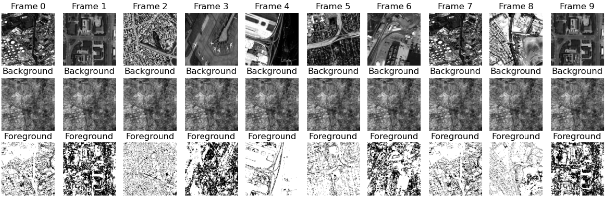
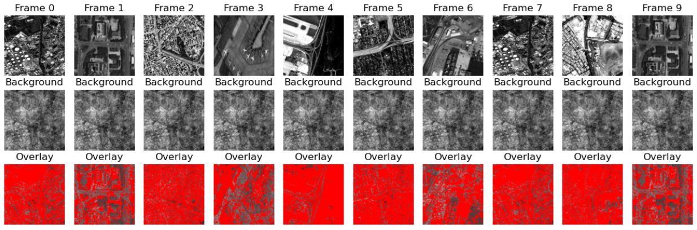
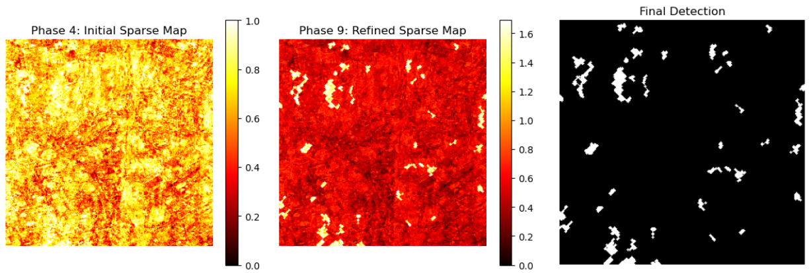

# HiEUM: Unsupervised Moving Object Detection (Re-implementation)

This repository contains an educational and qualitative re-implementation of the paper:

**Highly Efficient and Unsupervised Framework for Moving Object Detection in Satellite Videos**  
Chao Xiao et al., IEEE TPAMI.

## Overview
This project reproduces the main algorithmic pipeline of the HiEUM framework, including:
- Dataset reduction for hardware-limited environments
- Background modeling and motion extraction
- Initial sparse representation
- Pseudo-label generation and refinement
- Iterative self-evolution and sparse feedback
- Final moving object detection

The implementation focuses on qualitative analysis and algorithmic understanding rather than quantitative benchmarking.

## Original Work
- Official paper and code: https://github.com/ChaoXiao12/Moving-object-detection-in-satellite-videos-HiEUM

## Project Structure

The implementation is organized into sequential Jupyter notebooks,
each corresponding to one phase of the HiEUM framework:

- **Phase 0**: Dataset Reduction  
- **Phase 1**: Preprocessing  
- **Phase 2**: Background Modeling  
- **Phase 3**: Motion / Foreground Extraction  
- **Phase 4**: Sparse Motion Representation  
- **Phase 5**: Pseudo-label Generation  
- **Phase 6**: Label Refinement  
- **Phase 7**: Self-Evolution  
- **Phase 8**: Sparse Feedback  
- **Phase 9**: Final Detection  

All notebooks are located in the `notebooks/` directory and should be executed in order.

## Disclaimer
This is **not the official implementation**.  
All credits for the original method belong to the authors.

## Qualitative Results

Below are qualitative results from different phases of the HiEUM pipeline:

### Phase 2 – Foreground Motion Overlay

This figure illustrates the foreground motion extraction result in Phase 2 of the HiEUM framework. Detected moving regions are overlaid on the original satellite image after background modeling.

### Phase 2 – Binary Foreground Mask (Ground Truth)

This figure shows the binary foreground mask generated from bounding box annotations. White pixels represent moving objects, while black pixels indicate static background regions.

### Phase 3 – Foreground Extraction

### Phase 4 – Sparse Motion Map

### Phase 6 – Refinement

### Phase 9 – Final Moving Object Detection

### Sparse Overlay Comparison

This figure compares the sparse responses overlaid on the original image at Phase 4 and Phase 9. Phase 4 exhibits widely distributed and noisy sparse responses, while Phase 9 shows refined and concentrated activations corresponding to true moving objects.

### Residual Difference Map

This residual map highlights the regions where sparse responses are significantly refined between Phase 4 and Phase 9, demonstrating effective suppression of background noise.

### Sparse Value Distribution

The histogram comparison shows a clear shift toward lower sparsity values in Phase 9, indicating enhanced sparsity and energy concentration on meaningful motion regions.
